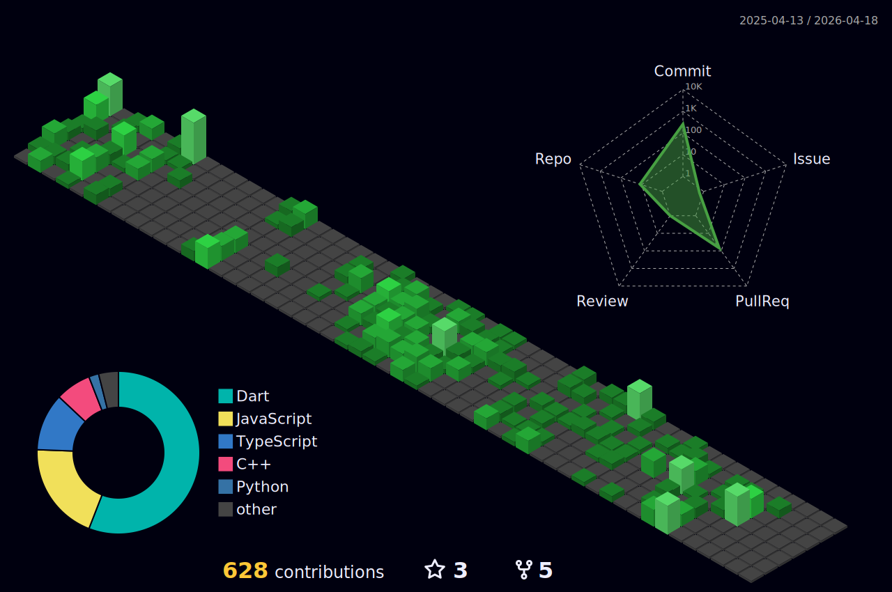
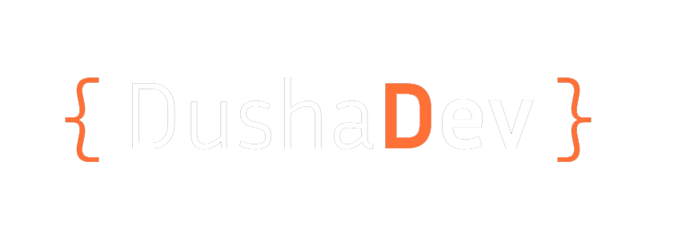

<h1 align="center">Hi 👋, I'm Dushan Madushanka</h1>
<h3 align="center">Ug. Software Engineer | Passionate About Mobile & Web Dev | UI-UX | Tech Enthusiast | Musicophile🎧| Stargazer✨</h3>

  

  

- 🔭 I’m currently working on **NSBM FindX Mobile app**

- 🌱 I’m currently learning **Next,Postman and Selenium**

- 👨‍💻 All of my projects are available at [dushadev](https://dushadev.github.io/)

- 📫 How to reach me **dushanmadushankabeligala9@gmail.com**

- 📄 Know about my experiences. [Get Resume](https://drive.google.com/file/d/1n--ewgHiY6CKVkJFCJv0YEMcbYIDVX6a/view?usp=sharing)

- ⚡ Fun facts:
   **Bananas are radioactive.🍌☢️**
   **If the age of the universe were compressed to one year, our history would be only a second.🌌**
   **Your heart can start to sync with the beat of the song.💖**

<h3 align="left">Connect with me</h3>

<h3 align="center">Languages and Tools</h3>

  

<h3 align="center">Contributions</h3>

  <!-- GitHub Stats -->
  

  <!-- Top Languages (Your Card) -->
  

  <!-- Streak Stats -->
  

<h3 align="center">Support</h3>

  

 

